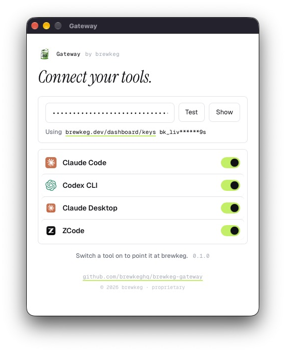

# Brewkeg Gateway

Point your coding tools at brewkeg. Two binaries, one engine.



| | Install |
|---|---|
| `brewkeg` CLI | `curl -fsSL https://brewkeg.dev/install.sh \| sh` |
| Brewkeg Gateway (desktop app) | download from a release |

## CLI

```bash
brewkeg setup              # pick tools, paste key
brewkeg setup --api-key bk_live_…
brewkeg status
brewkeg backups
brewkeg restore --dry-run
brewkeg restore
brewkeg reset                 # disconnect everything, clear caches, forget the key
```

## Desktop app (Brewkeg Gateway)

Open, paste your key, flip a switch. Every toggle backs up first and can be
undone. Open `desktop/frontend/index.html?demo=1` to see the UI without
launching it.

## What it writes

| Tool | File |
|---|---|
| Claude Code | `~/.claude/settings.json` (`env`, merged) + exports in your shell rc |
| Codex | `~/.codex/config.toml` — `[model_providers.brewkeg]` |
| ZCode | `~/.zcode/v2/provider_config.json` |
| Claude Desktop | `~/Library/Application Support/Claude-3p/configLibrary/` |

Existing keys are merged, never replaced. A displaced value is commented out as
`# brewkeg replaced:`. Everything is backed up to `~/.brewkeg/backups/<id>/`
before the first write and restores byte-exact.

`brewkeg reset` (or **Brewkeg Gateway → Reset Brewkeg Gateway…**) returns the machine to its
pre-brewkeg state inside one backup, then forgets the key. The desktop menu asks
first and lists what it found.

Not supported: [docs/unsupported-targets.md](docs/unsupported-targets.md).

## Build

```bash
go vet ./... && go test ./...
cd desktop && wails build -clean
goreleaser check
```

---

© 2026 brewkeg. All rights reserved. Proprietary — see [LICENSE](LICENSE).
